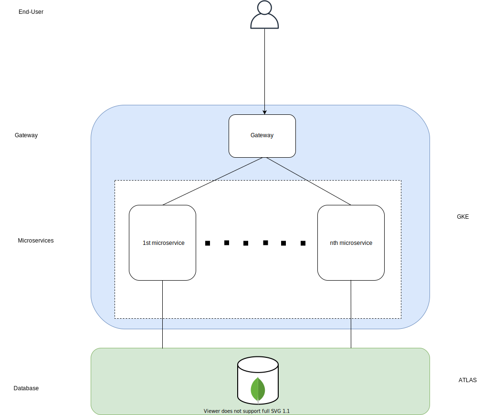

WISP consists of a set of loosly coupled, collaborating services. This structure is what's known as a `microservice` architecture where each service can be developed, tested, deployed, scaled, and maintained independently from the others.

## Diagram

This is a high-level overview of WISP's architecture:

 

 

## Components

### Gateway
The gateway is responsible for routing traffic to the microservices. Through a set of predefined rules, the gateway analyses the user's request and routes it to the appropriate service. This is also where part of the authorization will occur as, before routing the request, the gateway will forward the user's token to one of our microservices which will in turn check for the appropriate permissions and instruct the gateway to either allow or deny the request. 

We currently use NGINX for our gateway.

### Microservices
The microservices are simple APIs that handle one or, if absolutely necessary, two resources. They all come equipped with basic CRUD functionality as well as some custom routes that follow REST conventions. While independent from each other in terms of development and deployment, they can still communicate through HTTP (until an event/messaging system is implemented). One thing to note is that service to service communication doesn't go through the gateway and doesn't require authorization or authentication.

We use Express for our APIs and Vue for our UI.

### Database
We use a managed MongoDB solution for our database called `Atlas`. Our instances are deployed and managed on GCP so we don't have to go through maintaining and updating them.
